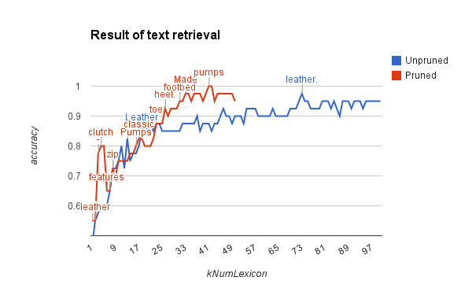

# CBIR
A demo program of a content-based image retrieval system using visual and textual features

## How to run the program?
### Prerequisites
- OpenCV (v3.0, built from the source code)
- Boost (the latest version download from Homebrew)
- CMake

### Compile and run
- Clone the re

## Overview of the program
1. Pre-compute the image/text feature for all images in a data set
2. Given a query image from a separated data set, compute the image/text feature of that image, and calculate the sum of square (SSD) distance between the feature of the query image and the entire data set
3. Pick the top `kNumQuery` images in terns of minimum SSD, and then choose the majority of the ensemble as a final prediction
4. Evaluate the accuracy of the predictions through the entire query image set

### The image feature
- The image feature is a simple 32 by 32 black and white patch.

### The text feature
- The text feature is a histogram of lexicon choosing from top `kNumLexicon`.
- Here is an example of a lexicon built with the 20 most frequent words (i.e. `kNumLexicon=20`) in the data set:

~~~
3393 [a]
3220 [and]
2586 [with]
2382 [the]
1297 [;]
1212 [leather]
1185 [of]
1058 [in]
1013 [The]
1004 [for]
 980 [to]
 872 [your]
 836 [-]
 811 [from]
 764 [is]
 646 [This]
 520 [A]
 494 [clutch]
 488 [Leather]
 432 [features]
~~~

### The hybrid feature
- The hybrid feature is a linear combination of the SSDs computed from image and text features.
- E.g `kAlpha` * SSD_image + (1-`kAlpha`) * SSD_text

##Evaluations

### Th image feature
Using the image feature only have achieved a high accuracy of 0.925 (37/40).

### The textual feature
I tried both not pruning and pruning the lexicon by removing the stop words, such as "a", "for", "the", ...etc.

My observation is the accuracy is roughly proportional to  the number of words in the lexicon.
Even using the unpruned lexicon, the accuracy would slowly converge to an accuracy of 0.95.
Here is a summary of the number of words in the lexicon to the accuracy:

The pruned lexicon reaches the convergence accuracy rate 0.95 only using 11 words (the 11th word is "bag").
Yet the unpruned lexicon needs 69 words (the 69th word is "These") to get an 0.95 accuracy rate.
In both lexicon, there are some keywords (annotating in the figure) boosting the accuracy.
Generally speaking, the burned lexicon has the following benefits:
1. Gathering such keywords faster than the unpruned one
2. Having no distraction from the stop words

### The hybrid feature
From the above results we know the best accuracy using image feature is 0.925 and the best accuracy using text feature is 1 with a pruned lexicon with `kNumLexicon=39` chose from the top 62 frequent words.
The hybrid feature might not perform better than that lexicon.
So let's make a scenario for the hybrid feature.

Say we only have limit budget on the number of lexicon, for instance, `kNumLexicon=8` for reaching the 0.925 accuracy.
With the hybrid feature, the result can be slightly better than the individual image/text retrieval.

| `kAlpha` | Text  | Hybrid | Image |
| -------- |:----: |:------:|:------|
| 0        | 0.925 | 0.925  | 0.925 |
| 0.1      | 0.925 | 0.95   | 0.925 |
| 0.01     | 0.925 | 0.95   | 0.925 |
| 1        | 0.925 | 0.925  | 0.925 |

## Log
1. 01/29/2015 System setup (installed the latest OpenCV and Boost, and wrote the CMakeLists.txt)
2. 02/04/2015 Commit ImageRetrieval v1.0
3. 02/12/2015 Commit TextRetrieval v1.0
5. 02/14/2015 Commit HybridRetrieval v.10
6. 02/16/2015 Evaluation
7. 02/17/2015 Fixed bugs in HybridRetrieval (zero comparisons, including other text files)
