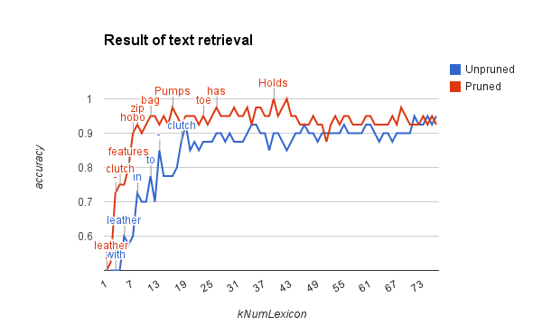

# CBIR
A demo program of a content-based image retrieval system using visual and textual features

## Prerequisites
- OpenCV (v3.0, built from the source code)
- Boost (the latest version download from Homebrew)
- CMake

## Overview of the program
1. Pre-compute the image/text feature for all images in a data set
2. Given a query image from a separated data set, compute the image/text feature of that image, and calculate the sum of square (SSD) distance between the feature of the query image and the entire data set
3. Pick the top `kNumQuery` images in terns of minimum SSD, and then choose the majority of the ensemble as a final prediction
4. Evaluate the accuracy of the predictions through the entire query image set

### The image feature
- The image feature is a simple 32 by 32 black and white patch.

### The text feature
- The text feature is a histogram of lexicon choosing from top `kNumLexicon`.
- Here is an example of a lexicon built with the 20 most frequent words (i.e. `kNumLexicon=20`) in the data set:

~~~
3393 [a]
3220 [and]
2586 [with]
2382 [the]
1297 [;]
1212 [leather]
1185 [of]
1058 [in]
1013 [The]
1004 [for]
 980 [to]
 872 [your]
 836 [-]
 811 [from]
 764 [is]
 646 [This]
 520 [A]
 494 [clutch]
 488 [Leather]
 432 [features]
~~~

I did not kick off stop words such as "a" or "the" from the lexicon. Instead, I used all of the high frequency words.

### The hybrid feature
- The hybrid feature is a linear combination of the SSDs computed from image and text features.
- E.g `kAlpha` * SSD_image + (1-`kAlpha`) * SSD_text

##Evaluations

### Baseline
Using the image feature only have achieved an high accuracy of 0.925 (37/40).

### Number of words in the lexicon
The number of words in the lexicon affected the prediction accuracy. However, the way it affected was out of my expectation. 

## Log
1. 01/29/2015 System setup (installed the latest OpenCV and Boost, and wrote the CMakeLists.txt)
2. 02/04/2015 Commit ImageRetrieval v1.0
3. 02/12/2015 Commit TextRetrieval v1.0
5. 02/14/2015 Commit HybirdRetrieval v.10
6. 02/16/2015 Setup gflags in CMakeLists.txt failed (TODO)